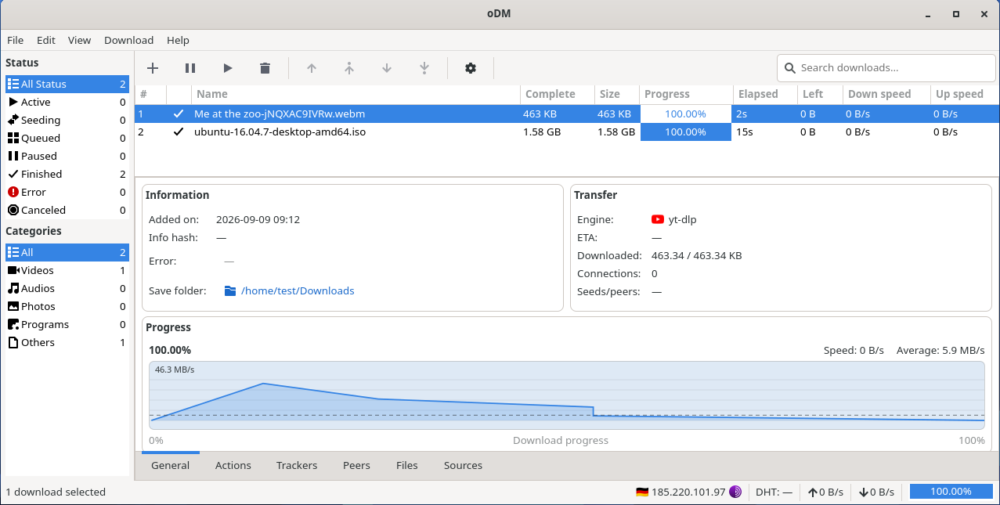

# Open Download Manager

[](https://github.com/albilu/open-download-manager/actions/workflows/test-ci.yml)
[](https://github.com/albilu/open-download-manager/actions/workflows/release-ci.yml)
[](https://github.com/albilu/open-download-manager/releases)
[](LICENSE)
[](https://openjdk.org/projects/jdk/25/)
[](packaging/)

> A native GTK download manager for Linux — one queue for HTTP/FTP, BitTorrent, video, and website mirrors, with privacy routing and crash-safe resume.

Open Download Manager (ODM) combines proven engines — aria2, yt-dlp, and HTTrack — with persistent history, queue controls, and recovery after restarts.

[Features](#features) · [How ODM compares](#how-odm-compares) · [Installation](#installation) · [Building from source](#building-from-source)



## Features

- Multi-connection HTTP, HTTPS, and FTP downloads
- BitTorrent, magnet, and Metalink support
- Video and media downloads through yt-dlp
- Website mirroring through HTTrack
- Pause, resume, cancel, reorder, and concurrent download limits
- Clipboard URL monitoring and torrent/Metalink folder monitoring
- Persistent download history and automatic resume
- Speed limits, mirrors, retries, scheduling, and batch imports
- Proxy, proxychains, and Tor routing, plus [proxy rotation](core/src/main/java/org/manager/proxy/README.md)
- After-completion actions (notify, open file, verify, suspend, shutdown)
- Native GTK4 interface with search, filtering, detail views, and tray/background mode

## How ODM compares

Generic HTTP/FTP, BitTorrent/magnet and yt-dlp media are table stakes. ODM combines them with a Linux-native, privacy and recovery stack in one queue.

| Area | ODM | Varia | Motrix | Persepolis | AB DM | KGet | JDownloader | FileCentipede | IDM | uGet |
|---|---|---|---|---|---|---|---|---|---|---|
| Native Linux desktop | ✅ GTK4/Libadwaita, fully open-source | ◐ | ◐ | ◐ | ◐ | ◐ | ◐ | ◐ | ❌ | ❌ |
| Privacy routing | ✅ Tor lifecycle + health + proxychains + proxy rotation on 403/429/5xx | ❌ | ❌ | ◐ | ◐ | ❌ | ◐ | ◐ | ◐ | ❌ |
| Recovery & persistence | ✅ XDG settings + SQLite history + aria2 session + ordered events + auto-resume | ❌ | ❌ | ❌ | ◐ | ◐ | ◐ | ❌ | ◐ | ❌ |
| Unified multi-engine queue | ✅ aria2 + yt-dlp + HTTrack + curl fallback in one queue | ◐ | ◐ | ◐ | ❌ | ◐ | ◐ | ◐ | ◐ | ❌ |
| Watch & clipboard automation | ✅ `.torrent` + `.metalink`/`.meta4` folder watch + clipboard polling | ◐ | ◐ | ◐ | ◐ | ◐ | ◐ | ❌ | ◐ | ❌ |
| Weekly scheduler | ✅ weekday spans + presets with in/out-window policy | ✅ | ❌ | ✅ | ✅ | ◐ | ◐ | ❌ | ✅ | ❌ |
| Post-completion pipeline | ✅ checksum + AV + subs + move + cmd + sound + suspend/shutdown with logs | ❌ | ❌ | ❌ | ◐ | ◐ | ◐ | ◐ | ◐ | ❌ |
| Site mirroring | ✅ HTTrack as dedicated `WEBSITE_SCRAPING` type | ❌ | ❌ | ❌ | ❌ | ❌ | ◐ | ❌ | ◐ | ❌ |
| Distribution packaging | ✅ `.deb` / `.rpm` / `.pkg.tar.zst` with bundled `jlink` Java 25 runtime | ◐ | ✅ | ◐ | ✅ | ◐ | ◐ | ◐ | ❌ | ❌ |

Legend: ✅ full support · ◐ partial support · ❌ missing / undocumented in reviewed first-party sources (2026-08-19, not a claim of absence).

## Requirements

- GTK 4 (>= 4.10)
- aria2 (>= 1.34.0)
- yt-dlp (>= 2024.01.01)
- HTTrack (>= 3.49.0)
- curl (>= 7.80.0)

Optional but recommended: proxychains, Tor, and FFmpeg.

## Installation

Packages are produced for Debian/Ubuntu (`.deb`), Fedora/RHEL (`.rpm`), and Arch (`pkg.tar.zst`). Each package bundles a trimmed Java 25 runtime; GTK4 and the download tools above are still required from the host system.

```sh
# Debian/Ubuntu
sudo apt install ./open-download-manager_*.deb OR sudo dpkg -i open-download-manager_*.deb

# Fedora/RHEL
sudo rpm -i open-download-manager-*.rpm

# Arch
sudo pacman -U open-download-manager-*.pkg.tar.zst
```

## Building from source

Source builds require JDK 25, Maven, a Linux native toolchain, and GTK4 development libraries. The supported development environment is Docker-based:

```sh
make build     # build the odm-dev Docker image
make compile   # compile and package the project
make test      # run the full test suite (starts Xvfb)
make package   # build .deb, .rpm, and pkg.tar.zst artifacts
make dev       # open an interactive development container
make run       # launch the application with GUI forwarding
make debug     # launch with a suspended debugger on port 5005
```

## Powered by

ODM builds on the work of these outstanding open-source projects:

- [yt-dlp](https://github.com/yt-dlp/yt-dlp)  — video and media extraction with format discovery
- [curl](https://github.com/curl/curl)  — process-based HTTP fallback and proxy-capable downloads
- [aria2](https://github.com/aria2/aria2)  — multi-protocol download engine (HTTP/FTP, BitTorrent, Metalink) over local JSON-RPC
- [Jackett](https://github.com/Jackett/Jackett)  — API Support for your favorite torrent trackers
- [proxychains-ng](https://github.com/rofl0r/proxychains-ng)  — SOCKS/HTTP proxy chaining
- [Tor](https://www.torproject.org/)  — optional privacy routing through the local SOCKS service
- [HTTrack](https://github.com/xroche/httrack)  — website mirroring with depth and filter controls
- [java-gi](https://github.com/jwharm/java-gi)  — native GTK4 desktop interface from Java
