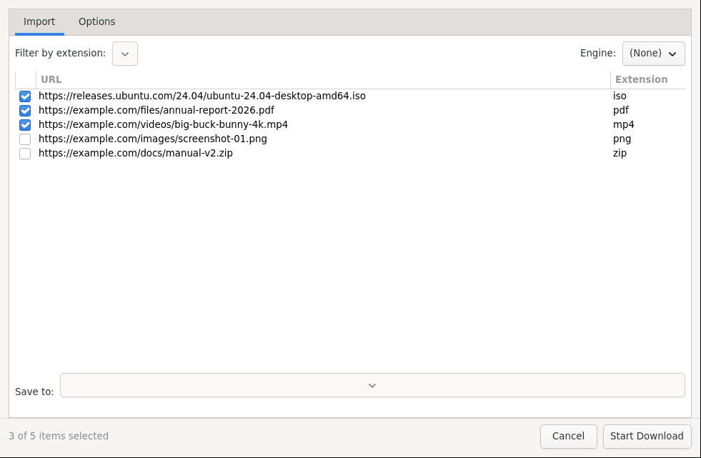

# Automation

Let Open Download Manager watch, import, schedule, and finish work for you.

*Batch Import: paste or load many URLs, filter by extension, pick an engine, then Start Download.*

## Clipboard monitoring

1. Enable it in Settings → General → **Enable clipboard monitoring**.
2. Copy any download link in your browser — the New Download dialog offers it automatically.
3. **Silent mode** queues clipboard links without asking.

## Folder monitoring

1. Set Settings → General → **Monitored folder**.
2. Enable **Enable folder monitoring** (optionally **Recursive**).
3. Drop `.torrent`, `.metalink`, or `.meta4` files there — they queue automatically.
4. Optionally move processed files to Trash to keep the folder clean.

## Batch imports

- **Import list**: File → Import from file / Import from clipboard. Paste dozens of links, filter by extension, pick the engine, then Start Download.
- **Import sequence**: generate numbered URLs (for example `file001.zip` … `file100.zip`) from a pattern.
- **Remote import**: fetch a list of links from a URL.

The screenshot above shows the import list with URL and extension columns and per-import save folder.

## Scheduler

1. Go to Settings → Scheduling → **Enable scheduling**.
2. Pick a preset: Always, Business hours, Night, Weekend, Weekday, or Never.
3. Choose what happens outside the window: queue and wait, or restrict starts.

Useful for night downloads or shared connections.

## After a download finishes

Set completion actions per download (Actions tab) or globally:

- Show a notification / play a sound.
- Verify checksum, run antivirus scan.
- Download subtitles, move the file.
- Run a custom command.
- Suspend or shut down the computer (with a 30-second cancel window).

Check results in the Actions tab and the action log.

Next: [Settings and Reference](Settings-and-Reference.md).
