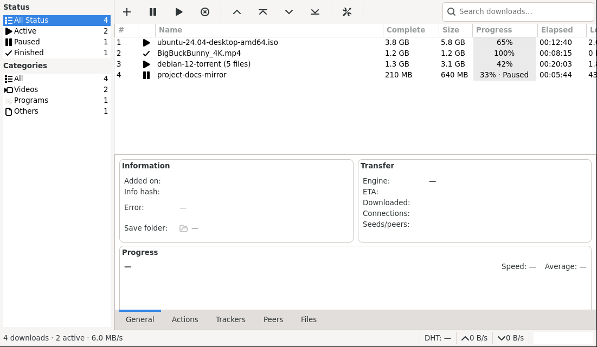
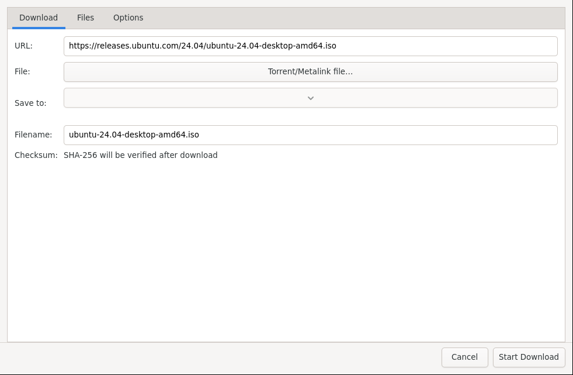

# Managing Downloads

This is your everyday view: add links, track progress, pause and resume, and inspect details.

*Status filters and categories on the left, the queue in the center, Information / Transfer / Progress and tabs at the bottom.*

## Add a file download

1. Press **+** (New download) in the toolbar.
2. Paste a URL, magnet link, or pick a `.torrent` / `.metalink` file.

*New Download: paste a URL or choose a torrent file, set the save folder and filename, then Start Download.*

3. Set **Save to** and **Filename** if needed.
4. Press **Start Download**. The item appears in the queue with live speed, progress, and time left.

Use the **Files** tab in the dialog to uncheck files you do not want from a torrent. Use **Options** for per-download speed, retries, and proxy.

## Control the queue

- **Pause / Resume**: select one or more downloads, then press Pause or Start/Resume.
- **Reorder**: use the up / top / down / bottom arrows to change queue order.
- **Concurrent limit**: Settings → General → Max concurrent downloads (for example 3 at a time, the rest wait).
- **Delete**: Delete removes the entry; Delete with Files also removes the downloaded data.

Closing the app does not lose progress — downloads resume automatically on next start.

## Find and filter

- Type in **Search downloads…** (top right) to filter by name.
- Click a **Status** on the left (Active, Queued, Paused, Finished, Error, Canceled) or a **Category** (Videos, Audios, Photos, Programs, Others) to narrow the list.

## Inspect details

Select a download and use the bottom tabs:

- **General**: save folder, engine, ETA, connections, seeds/peers, progress graph.
- **Actions**: what will run when it finishes (see [Automation](Automation.md)).
- **Trackers / Peers / Files / Sources**: live BitTorrent and mirror information.

The status bar shows overall up/down speed and DHT status.

Next: [Media Downloads](Media-Downloads.md) for video, or [Torrents and Search](Torrents-and-Search.md) for torrents.
