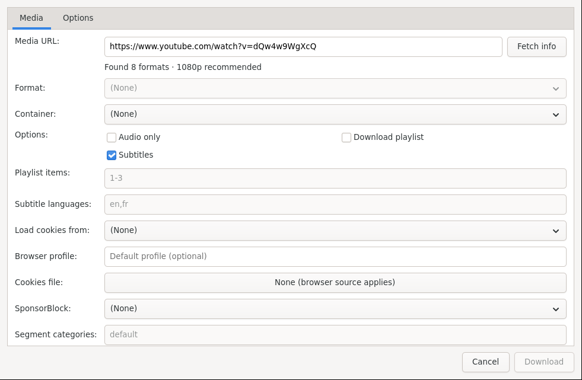

# Media Downloads

Save videos, audio, playlists, and subtitles. Open Download Manager uses yt-dlp behind the scenes.

*New Media: paste a page URL, Fetch info, pick format and options, then Download.*

## Download a video

1. Choose **File → New media download** (or the media button).
2. Paste the video page, playlist, or direct media URL into **Media URL**.
3. Press **Fetch info** and wait for the format list.
4. Pick a **Format** (quality), and optionally:
   - **Audio only** for music / podcasts.
   - **Download playlist** + **Playlist items** (for example `1-10` or `1,3,8`) for playlists.
   - **Subtitles** + **Subtitle languages** (for example `en,fr`).
   - **Load cookies from** a browser if the video needs login.
   - **SponsorBlock** to skip sponsored segments where supported.
5. Choose the save folder and press **Download**.

## Tips

- If a site asks for login, export cookies from your browser and select them under **Cookies file** or **Load cookies from**.
- For audio-only with best quality, tick **Audio only** and leave Format on the recommended choice.
- Playlist downloads appear as individual items you can pause and reorder like any other download.
- Subtitle files are saved next to the video when available.

Next: [Website Mirroring](Website-Mirroring.md) or [Managing Downloads](Managing-Downloads.md).
