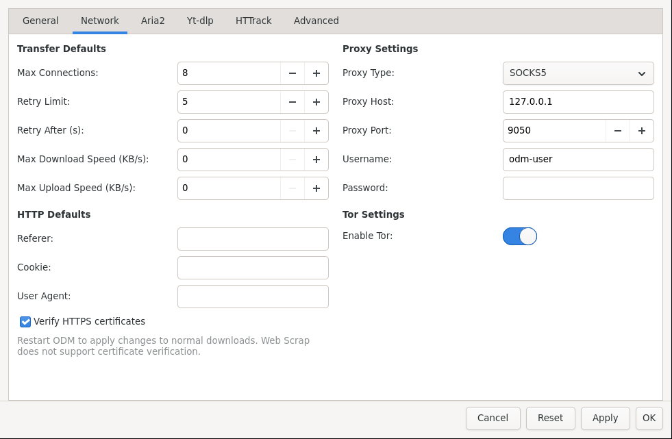

# Privacy and Network

Route downloads through a proxy, proxychains, or Tor — globally or per download.

*Settings → Network with a SOCKS5 proxy and Tor enabled. Per-download proxy and Tor switches live in each download dialog under Options.*

## Quick choices

- **Just one sensitive download?** Open its **Options** tab when creating it (or Properties afterwards) and set proxy / Tor only there.
- **Everything private?** Enable Tor or a proxy in **Settings → Network** so new downloads inherit it.
- **Blocked or rate-limited (403 / 429 / 5xx)?** Enable proxy rotation with a list of proxies — Open Download Manager rotates on retry.

## Use Tor

1. Install Tor and make sure the local SOCKS service runs (usually `127.0.0.1:9050`).
2. In the main window status bar, toggle the **Tor** button, or go to Settings → Network → Tor.
3. The Tor icon shows verification progress and the exit IP when connected.
4. For a single download, open New Download → Options → Tor switch instead of the global toggle.

Use **New Identity** from the Tor menu if a site blocks the current exit.

## Use a proxy or proxychains

1. Go to Settings → Network → Proxy type (HTTP / SOCKS5), host, port, username/password if needed.
2. For proxychains, install `proxychains4`/`proxychains` and set its path in Settings → Advanced tools.
3. Per-download overrides: New Download / New Media / Properties → Options → proxy fields. Leaving them empty inherits the global setting.

## Speed and retries

- **Max concurrent downloads** and **speed limits** live in Settings → General and Settings → Network, and can be overridden per download.
- **Retries and delays** help with flaky servers; proxy rotation helps with rate limits.
- Tor is slower than direct — use it where privacy matters, direct where speed matters.

Next: [Automation](Automation.md).
