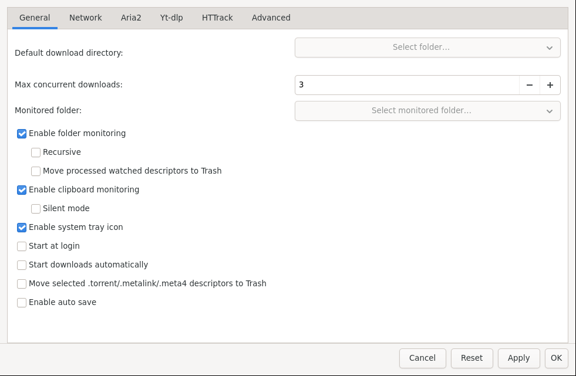

# Settings and Reference

*Settings tabs: General, Network, Aria2, Yt-dlp, HTTrack, Advanced — plus Search Engine for torrent search.*

## The tabs

- **General**: download folder, concurrent downloads, folder/clipboard monitoring, tray, autostart, history.
- **Network**: speed limits, connections, retries, proxy, Tor, scheduling defaults.
- **Aria2**: splits per server (1–16), seed ratio/time, encryption, DHT.
- **Yt-dlp**: tool path, thumbnails, metadata, format defaults.
- **HTTrack**: size/time/link limits, connections, delays.
- **Advanced**: history cleanup, import limits, antivirus, custom tools, completion defaults.
- **Search Engine**: Jackett URL and indexers for [Torrent Search](Torrents-and-Search.md).

Press **Apply** to test without closing, **OK** to save and close, **Reset** to restore defaults.

## Tray and background

- Enable **System tray icon** to minimize to tray instead of closing.
- Close-to-tray keeps downloads running in the background with speed tooltip.
- Needs a system tray / StatusNotifier host; otherwise the app stays in the taskbar.

## Troubleshooting

- **Download stuck at 0%?** Check the Trackers/Peers tabs (torrents) or try more connections / a mirror (files). Test without proxy/Tor.
- **403 / 429 errors?** The site is rate-limiting — slow down, add a delay, or enable proxy rotation in Network settings.
- **Video Fetch info finds nothing?** Update yt-dlp, check cookies/login, or try another format.
- **Mirror too big?** Lower Depth, tighten Include/Exclude, set HTTrack size/link limits.
- **No sound / no shutdown?** Check the Actions tab log and your desktop permissions for suspend/shutdown.
- **App was killed?** Restart — state and history restore automatically; press Resume on anything still paused.

## Keyboard and pointer shortcuts

- **+**: new download · **Space**: pause/resume selection · **Delete**: remove · **Ctrl+F**: search · **Double-click**: properties · **Right-click**: full context menu (open file/folder, copy link, recheck, subtitles, mirrors).

Back to [Home](Home.md).
