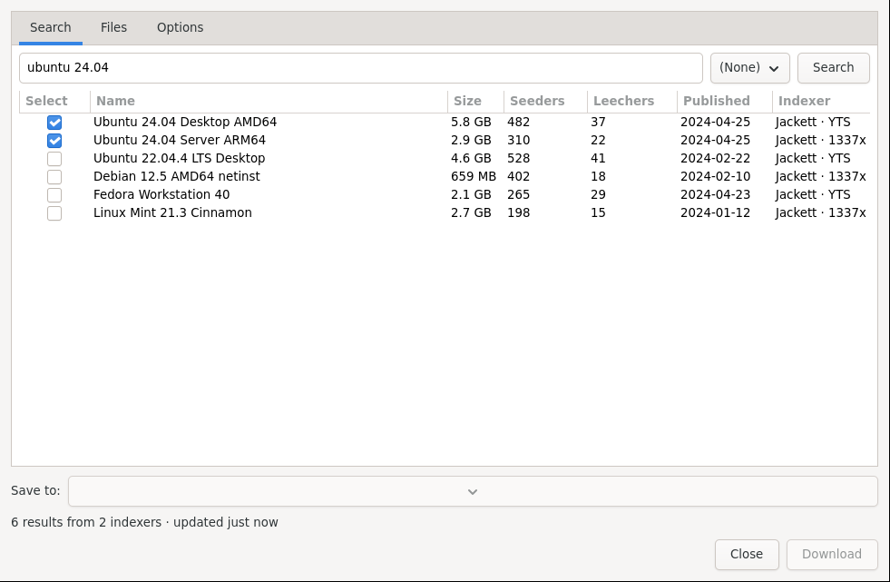

# Torrents and Search

Download `.torrent` files, magnet links, and Metalinks, pick files inside, and search supported trackers without leaving the app.

*Torrent Search: type a query, press Search, tick results, choose Save to, then Download.*

## Add a torrent or magnet

1. Press **+** (New download).
2. Either paste a magnet link into **URL**, or press the file button and pick a `.torrent`, `.metalink`, or `.meta4` file.
3. Open the **Files** tab to uncheck what you do not need.
4. Press **Start Download**.

While downloading, the **Trackers**, **Peers**, and **Files** tabs in the main window show live swarm and file progress. Double-click a torrent (or right-click → Properties) to change per-torrent limits.

## Search torrents in the app

1. Choose **File → Search torrents** (requires Jackett configured in Settings → Search Engine).
2. Type in **Search torrents…**, pick an indexer, and press **Search**.
3. Tick the rows you want, set **Save to**, and press **Download**.

Results go straight into the queue — no browser download folder detour.

## Tips

- Seeding continues after 100% depending on your seeding policy (Settings → Aria2). Watch the Ratio column.
- If a torrent is slow, check Trackers for errors and Peers for seed counts.
- Drop `.torrent` files into your monitored folder to auto-queue them (see [Automation](Automation.md)).

Next: [Privacy and Network](Privacy-and-Network.md).
