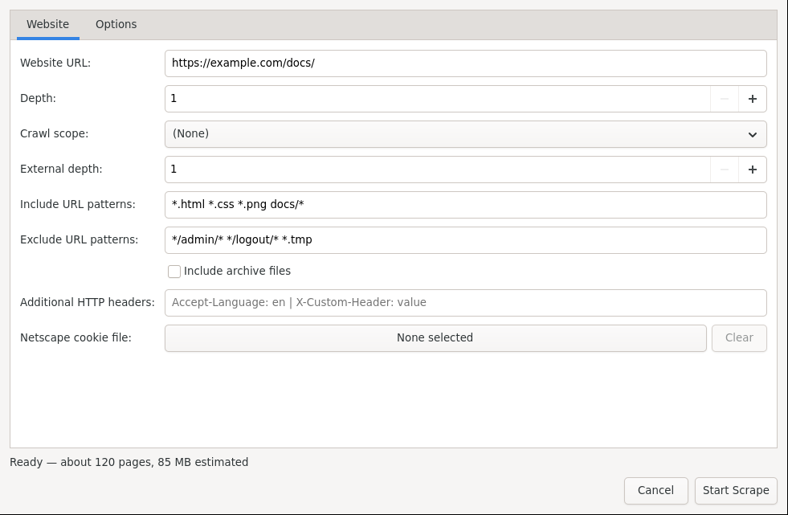

# Website Mirroring

Keep an offline copy of a website for travel, archiving, or slow connections. Open Download Manager uses HTTrack for this.

*New Website: set depth, scope, include/exclude patterns, then Start Scrape.*

## Mirror a site

1. Choose **File → New website scrape**.
2. Enter the **Website URL** (for example `https://example.com/docs/`).
3. Set **Depth** (how many link levels to follow) and **Crawl scope** (stay on the same site or allow external links).
4. Refine with:
   - **Include / Exclude URL patterns** (for example include `*.html *.css`, exclude `*/admin/* */logout/* *.tmp`).
   - **Include archive files** if you also want zip/tar contents.
   - **Additional HTTP headers** and a **Netscape cookie file** for sites that need login.
5. Open **Options** for speed and retry limits, then press **Start Scrape**.

Mirrored files go to your download folder in a site subfolder. Open the local `index.html` to browse offline.

## Tips

- Start with Depth 1–2 on large sites, then go deeper if needed.
- Exclude logout, search, and admin paths to avoid junk pages and endless calendars.
- Respect the site's terms and robots rules — mirror your own content or sites that allow it.
- Use pause/resume like any other download if you need to stop midway.

Next: [Torrents and Search](Torrents-and-Search.md) or [Automation](Automation.md).
